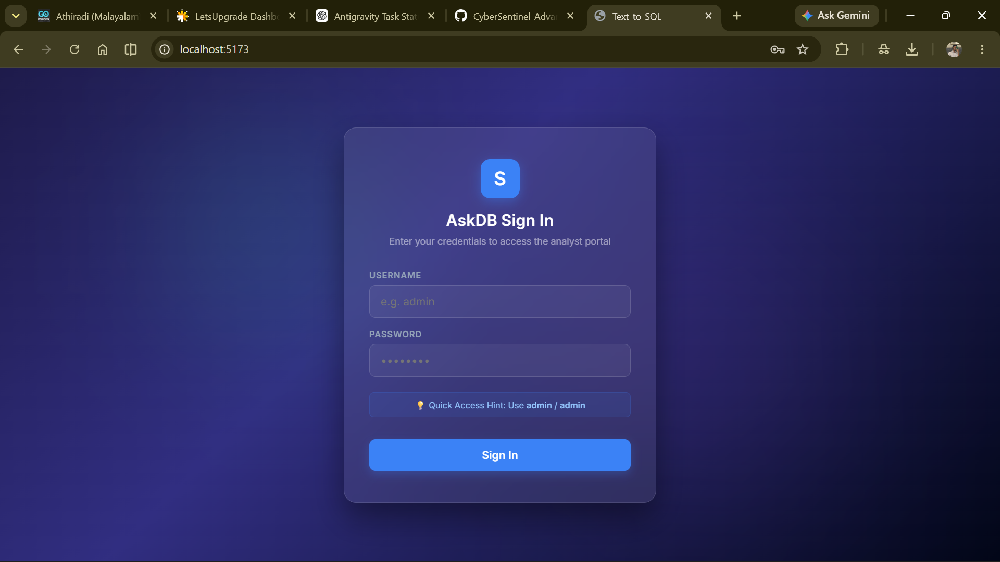
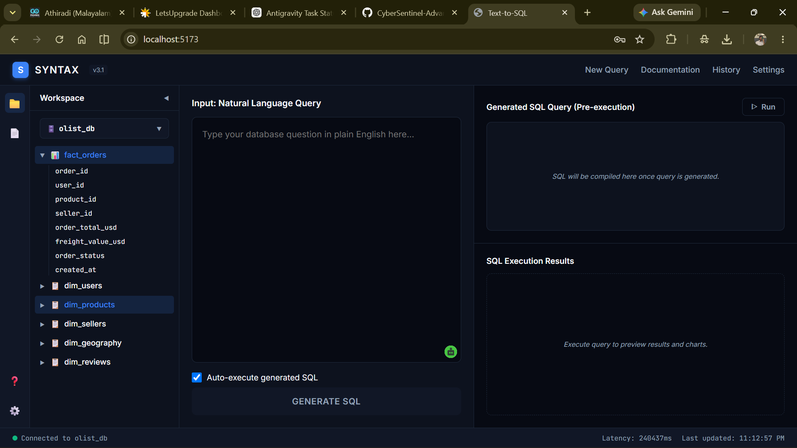
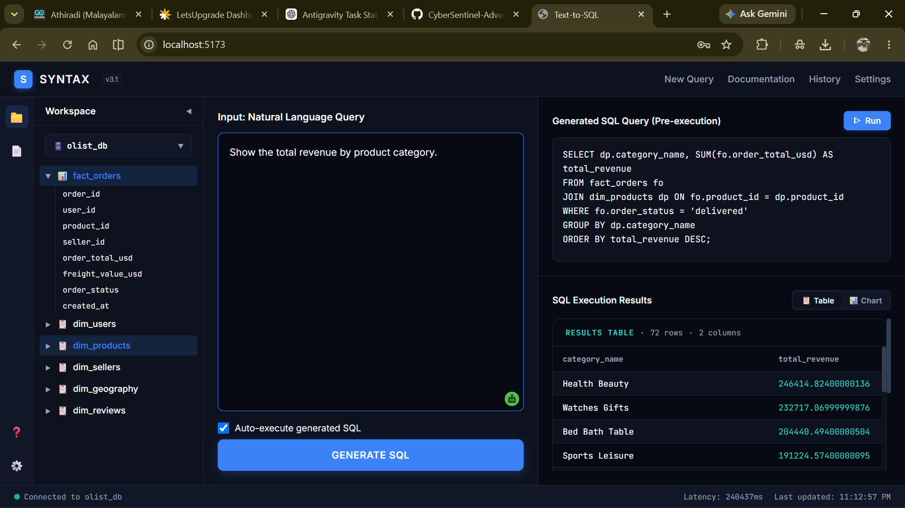
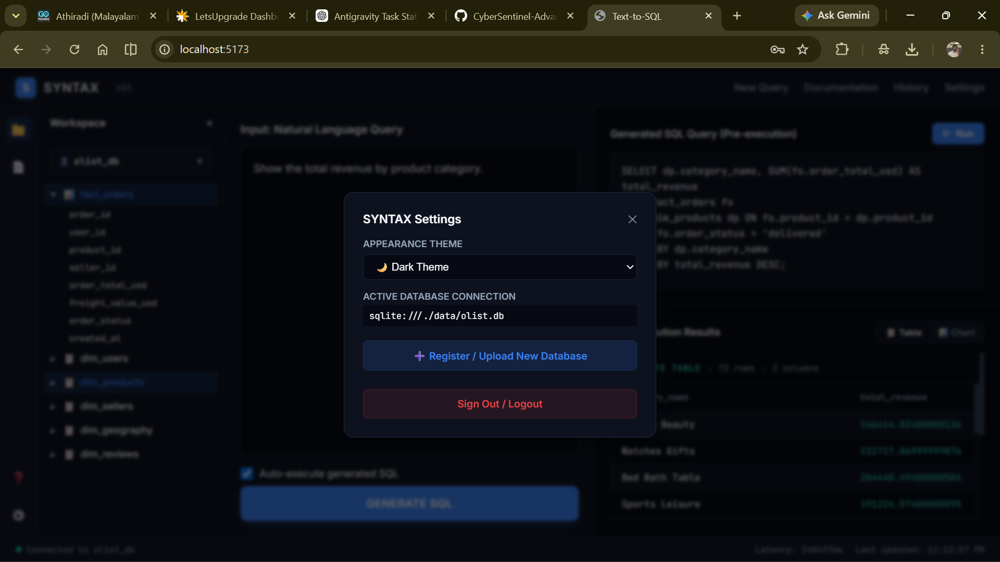

# 🧠 AskDB — AI-Powered Data Query Assistant

💬 Ask questions in plain English  
⚡ Get accurate SQL queries + real database insights instantly  
🚀 No SQL knowledge required  

---

## 🌟 Overview

**AskDB** is an AI-powered system that allows users to interact with databases using natural language.

Instead of writing complex SQL queries, users can simply ask:

> “What are the top product categories by revenue this year?”

…and the system will:
- 🧠 Understand the intent  
- ⚙️ Generate optimized SQL  
- ⚡ Execute it on a real database  
- 📊 Return clean, structured results  

---

## 🎯 Why This Project Matters

Traditional Text-to-SQL systems fail in real-world scenarios due to:
- ❌ Large schema complexity  
- ❌ Poor context understanding  
- ❌ Hallucinated queries  
- ❌ Lack of safety mechanisms  

👉 **AskDB solves this using AI + intelligent architecture**

---

## 🧩 Key Features

- 💬 Natural Language → SQL conversion  
- 🧠 LLM-powered query understanding  
- 🔎 RAG-based schema retrieval (only relevant tables used)  
- 📊 Real-time query execution  
- 🛡️ Safety guard (blocks destructive queries)  
- ⚡ Deterministic SQL generation (temperature = 0)  
- 📜 Query logging & observability  
- 🎨 Interactive frontend (chat + results view)  

---

## 🏗️ System Architecture

- **Frontend:** React (chat interface + results visualization)  
- **Backend:** FastAPI (API + query pipeline)  
- **AI Layer:** LLM (OpenAI / Ollama)  
- **Vector DB:** ChromaDB (semantic retrieval)  
- **Database:** SQLite / PostgreSQL  

---

## 🔄 How It Works (Pipeline)

1. User enters a natural language query  
2. Query is converted into embeddings  
3. Relevant tables retrieved using RAG  
4. Prompt built with schema + examples  
5. LLM generates SQL query  
6. Query validated using safety checks  
7. SQL executed on database  
8. Results returned and displayed  

---

## 🧠 Core Innovations

### 🔎 Retrieval-Augmented Generation (RAG)
Only the most relevant tables are selected dynamically, avoiding context overload.

### 📖 Semantic Layer
Tables and columns include business-aware descriptions to guide the LLM.

### 🛡️ Safety Guard (HITL)
Prevents execution of harmful queries like:
- DELETE  
- DROP  
- UPDATE

- 

## 📊 What It Can Do

- ✅ Revenue analysis  
- ✅ Customer insights  
- ✅ Order trends  
- ✅ Multi-table joins  
- ✅ Complex SQL queries  

---

## ⚠️ Limitations

- LLM-generated SQL may not always be 100% accurate  
- Requires validation before production use  
- Limited to available dataset  

---

## 🧠 Future Improvements

- 🔊 Voice-based querying  
- 📈 Data visualization (charts)  
- 🔐 Role-based access control  
- 🌐 Multi-database support  
- 🤖 Auto query correction  

---

## 💼 Why This Project Stands Out

This project demonstrates:
- AI + Backend integration  
- Real-world system design  
- Data engineering concepts  
- Production-aware architecture  

👉 Built not just as a project, but as a **scalable AI system**

---

## 📸 Application Preview

| Sign In | Dashboard |
|----------|----------|
|  |  |

| Query Output | Settings |
|----------|----------|
|  |  |

## 🙌 Credits

This project is based on the open-source work from:  
https://github.com/nerdjerry/text-to-sql  

Enhanced and extended with additional features and improvements.

## 📁 Project Structure

```bash
AskDB/
├── agent/        # AI pipeline (RAG + SQL generation)
├── api/          # FastAPI backend
├── model/        # Database schema & ORM
├── frontend/     # React UI
├── data/         # Dataset & seeding scripts
├── infra/        # Deployment configs


